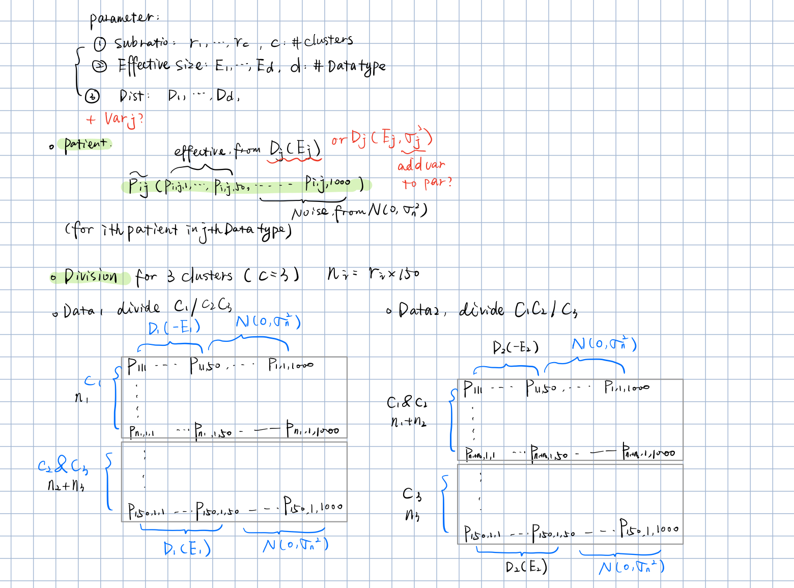

```{r,include = F}
knitr::opts_knit$set("../")
library(SIMLR)
library(abSNF)
library(igraph)
library(tidyverse)
source("./code/functions/SIMLR_multi.R")
source("./code/functions/simulation_function.R")
```

# simulation setting



# 3 methods we are comparing now:

1. abSNF (refer)
2. mk-SIMLR (finished)
3. weighted_mk_SIMLR(todo)

# Method2 multi-SIMLR
## Compare SNF's function

Here we using the most imbalanced case to show the advantage of multi-SIMLR:

### when the 2 data types have the same distribution 
```{r}
sim = simulation_2(eff_size = c(1,9), sub_ratio = c(0.1,0.1,0.8), dist = c("norm", "norm"),sigma = 5)
truelabel = sim$true_label
```

since same distribution, we have no normalization step here

#### abSNF 

```{r}
Data1 = sim$GE
weight1 = sim$ge_weight
Dist1 = dist2_w(as.matrix(Data1), as.matrix(Data1), weight1)
W1 = affinityMatrix(Dist1)

Data2 = sim$MI
weight2 = sim$mi_weight
Dist2 = dist2_w(as.matrix(Data2), as.matrix(Data2), weight2)
W2 = affinityMatrix(Dist2)

W = SNF(list(W1, W2))
cluster_SNF = spectralClustering(W, 3)
```

* here we are using 3 index to compare the clustering result
```{r}
cluster_purity = function(cluster, truth){
  comp = as_tibble(cbind(cluster,truth))
  purity = comp %>%
    group_by(truth) %>% 
    count(cluster) %>% 
    summarise(purity = max(n)/sum(n)) %>% 
    pull(purity)
  return(purity)
}
cluster_purity(cluster = cluster_SNF, truth = truelabel)
nmi_SNF = compare(cluster_SNF, truelabel,method = "nmi")
rand_SNF = compare(cluster_SNF, truelabel,method = "rand")
nmi_SNF
rand_SNF
```

  
#### multi-SIMLR with SNF initials

```{r}
mk1 = multiple.kernel(Data1)
mk2 = multiple.kernel(Data2)

## merge 2 kernel collections
D_kernels = list()
for(i in 1:(length(mk1)+length(mk2))){
  if(i<=length(mk1)){
    D_kernels[[i]] = mk1[[i]]
  }else{
    D_kernels[[i]] = mk2[[i-length(mk1)]]
  }
}

simlr_res_affSNF = SIMLR_multi_SNF(D_Kernels = D_kernels, c = 3, SNF_init = W)
simlr_res_noSNF = SIMLR_multi(D_kernels, c = 3)
```

* here we are using 3 index to compare the clustering result
```{r}
cluster_purity(simlr_res_affSNF$y$cluster, truelabel)
compare(simlr_res_affSNF$y$cluster, truelabel, method = "nmi")
cluster_purity(simlr_res_noSNF$y$cluster, truelabel)
compare(simlr_res_noSNF$y$cluster, truelabel, method = "nmi")
```


### when the 2 data types have different distributions
```{r}
sim = simulation_2(eff_size = c(1,9), sub_ratio = c(0.1,0.1,0.8), dist = c("norm", "logit"),sigma = 5)
truelabel = sim$true_label
```

#### normalization

```{r}
Data1 = standardNormalization(Data1)
Data2 = standardNormalization(Data2)
```


#### abSNF 

```{r}
Data1 = sim$GE
weight1 = sim$ge_weight
Dist1 = dist2_w(as.matrix(Data1), as.matrix(Data1), weight1)
W1 = affinityMatrix(Dist1)

Data2 = sim$MI
weight2 = sim$mi_weight
Dist2 = dist2_w(as.matrix(Data2), as.matrix(Data2), weight2)
W2 = affinityMatrix(Dist2)

W = SNF(list(W1, W2))
cluster_SNF = spectralClustering(W, 3)
nmi_SNF = compare(cluster_SNF, truelabel,method = "nmi")
rand_SNF = compare(cluster_SNF, truelabel,method = "rand")
nmi_SNF
rand_SNF
```

  
#### multi-SIMLR with SNF initials

```{r}
mk1 = multiple.kernel(Data1)
mk2 = multiple.kernel(Data2)

## merge 2 kernel collections
D_kernels = list()
for(i in 1:(length(mk1)+length(mk2))){
  if(i<=length(mk1)){
    D_kernels[[i]] = mk1[[i]]
  }else{
    D_kernels[[i]] = mk2[[i-length(mk1)]]
  }
}

simlr_res_affSNF = SIMLR_multi_SNF(D_Kernels = D_kernels, c = 3, SNF_init = W)
simlr_res_noSNF = SIMLR_multi(D_kernels, c = 3)
```

```{r}
cluster_purity(simlr_res_affSNF$y$cluster, truelabel)
compare(simlr_res_affSNF$y$cluster, truelabel, method = "nmi")
cluster_purity(simlr_res_noSNF$y$cluster, truelabel)
compare(simlr_res_noSNF$y$cluster, truelabel, method = "nmi")
```

### Conclusion:
SNF_initial seems has no special improvement here.
 
# Methods3: multi-SIMLR with weighted multiple kernels


# methods compare 

